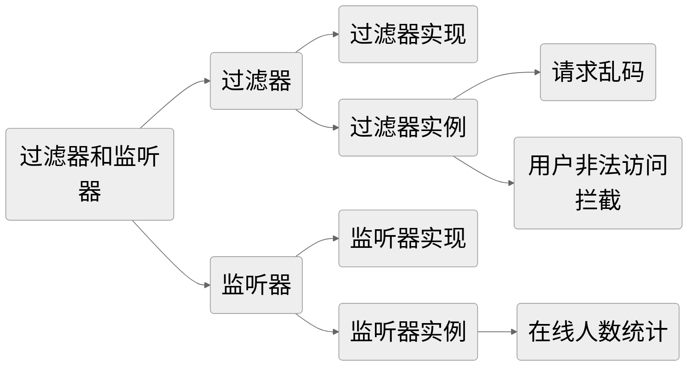
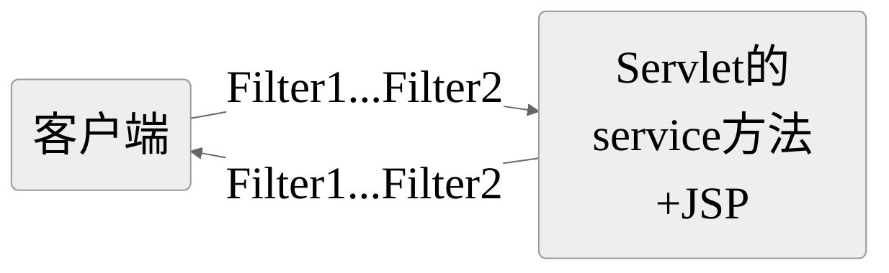

# 1.主要内容



# 2.过滤器

## 2.1.介绍

Filter即为过滤，用于Servlet之外对Request或者Response进行修改。它主要用于对用户请求进行预处理，也可以对HttpServletResponse进行后处理。使用Filter的完整流程：Filter对用户请求进行预处理，接着将请求交给Servlet进行处理并生成响应，最后Filter再对服务器响应进行后处理。在一个web应用中，可以开发编写多个FIlter，这些Filter组合起来称之为一个Filter链。



**<font color="red">若是一个过滤器链：先配置先执行（请求时的执行顺序）；响应时：以相反的顺序执行。</font>**

在HttpServletRequest到达Servlet之前，拦截客户的HttpServletRequest。根据需要检查的HttpServletRequest，也可以修改HttpServletRequest头和数据。

在HttpServletResponse到达客户端之前，拦截HttpServletResponse。根据需要检查HttpServletResponse，也可以修改HttpServletResponse的头和数据。

## 2.2.实现

过滤器：

1. @WebFilter("/url")	配置拦截的资源路径	 `/*是拦截所有`
2. doFilter()方法中需要设置方向，否则请求无法到达资源（filterChain.doFilter(servletRequest, servletResponse)）
   - doFilter()方法前是做请求拦截
   - doFilter()方法后是做响应拦截
3. 如果是过滤器链，则先配置的先执行（首字母在前的先执行）；响应时，顺序反过来即可

## 2.3.实例

### 2.3.1.请求乱码处理

### 2.3.2.用户非法访问拦截

```java
/*
* 非法访问拦截（当用户未登陆时，拦截请求到登陆页面）
*   拦截的资源：
*       拦截所有资源：\/*
*   需要被放行的资源：
*       不需要登陆即可访问的资源
*        1.放行指定页面 ，不要登陆可以放行的页面（如登陆页面、注册页面）
*        2.放行静态资源（例如：css、js、图片等）
*        3.放行指定操作，不需要登陆即可执行的操作（例如：登陆操作、注册操作）
*        4.登陆状态放行（如果存在指定的session对象，则为登陆状态）
* 			 其他请求需要被拦截跳转到登陆页面	
*/
```

# 3.监听器

## 3.1.介绍

web监听器时Servlet中一种的特殊的类，能帮助开发这坚挺web中的特定事件，比如ServletContext，HpptSession，ServletRequest的创建和销毁；变量的创建，销毁和修改等。可以在某些动作前后增加处理，实现监控。例如可以用来统计在线人数等。

## 3.2.实现

监听器有三类

1. **ServletContext 监听器**：用于监听整个 Web 应用程序的生命周期事件，通常与 `ServletContext` 相关。这些事件在 Web 应用程序启动和关闭时触发。
   - `ServletContextListener`：监听 `ServletContext` 的创建和销毁事件。
   - `ServletContextAttributeListener`：监听 `ServletContext` 属性的添加、删除和替换事件。
2. **ServletRequest 监听器**：用于监听客户端请求的生命周期事件，通常与 `ServletRequest` 相关。这些事件在请求到达服务器、被处理和响应发送给客户端时触发。
   - `ServletRequestListener`：监听 `ServletRequest` 的创建和销毁事件。
   - `ServletRequestAttributeListener`：监听 `ServletRequest` 属性的添加、删除和替换事件。
3. **HttpSession 监听器**：用于监听用户会话的生命周期事件，通常与 `HttpSession` 相关。这些事件在用户会话的创建、销毁以及会话中属性的添加、删除和替换时触发。
   - `HttpSessionListener`：监听 `HttpSession` 的创建和销毁事件。
   - `HttpSessionAttributeListener`：监听 `HttpSession` 属性的添加、删除和替换事件。
   - `HttpSessionBindingListener`：监听实现了该接口的对象绑定到会话或从会话中解绑的事件。

## 3.3.实例

`HttpSessionListener` 是 Java EE 中用于监听 `HttpSession` 生命周期事件的监听器。通过实现 `HttpSessionListener` 接口，您可以在 `HttpSession` 创建和销毁时执行自定义逻辑。以下是一个简单的 `HttpSessionListener` 实例，展示了如何在会话创建和销毁时记录日志：

```java
import javax.servlet.annotation.WebListener;
import javax.servlet.http.HttpSessionEvent;
import javax.servlet.http.HttpSessionListener;

@WebListener
public class MyHttpSessionListener implements HttpSessionListener {
    @Override
    public void sessionCreated(HttpSessionEvent se) {
        System.out.println("HttpSession created: " + se.getSession().getId());
    }

    @Override
    public void sessionDestroyed(HttpSessionEvent se) {
        System.out.println("HttpSession destroyed: " + se.getSession().getId());
    }
}
```

在这个示例中，`MyHttpSessionListener` 实现了 `HttpSessionListener` 接口，并使用 `@WebListener` 注解将它声明为一个监听器。当会话创建时，`sessionCreated` 方法将被调用，并在控制台上打印会话的 ID。同样地，当会话销毁时，`sessionDestroyed` 方法将被调用。

您可以在您的 Java EE Web 应用程序中部署这个监听器，然后当用户会话被创建或销毁时，会在控制台上看到相应的日志输出。

# 4.拦截器

### 4-1. 介绍

在 Java 中，拦截器是一种用于拦截请求、处理、事件等的组件，允许您在核心业务逻辑前后插入自定义逻辑。拦截器通常用于实现跨切面的横切关注点，如安全性、日志记录、事务管理等。在 Java EE 中，拦截器常用于处理 EJB（Enterprise JavaBeans）组件，而在 Spring 框架中，拦截器通常用于处理 Spring MVC 请求。

### 4-2. 实现

在不同的 Java 技术栈中，拦截器的实现方式可能会有所不同。以下是在两种常见情况下实现拦截器的方法：

#### 使用 Java EE EJB 拦截器：

在 Java EE 中，您可以使用 EJB 拦截器来拦截 EJB 组件的方法调用。这些拦截器可以在方法执行之前、之后或发生异常时执行自定义逻辑。

#### 使用 Spring MVC 拦截器：

在 Spring 框架中，您可以使用拦截器（Interceptor）来拦截和处理 Spring MVC 请求。这使您能够在请求处理之前和之后执行自定义操作。

### 4-3. 实例（使用 Spring MVC 拦截器）

以下是一个使用 Spring 框架中拦截器的示例，它演示了如何在处理请求之前和之后执行自定义逻辑：

```java
public class LogCostInterceptor implements HandlerInterceptor { long start = System.currentTimeMillis();
    @Override public boolean preHandle(HttpServletRequest httpServletRequest, HttpServletResponse httpServletResponse, Object o) throws Exception {
        start = System.currentTimeMillis(); return true;
    }
 
    @Override public void postHandle(HttpServletRequest httpServletRequest, HttpServletResponse httpServletResponse, Object o, ModelAndView modelAndView) throws Exception {
        System.out.println("Interceptor cost="+(System.currentTimeMillis()-start));
    }
 
    @Override public void afterCompletion(HttpServletRequest httpServletRequest, HttpServletResponse httpServletResponse, Object o, Exception e) throws Exception {
    }
}
```

```java
@Configuration 
public class InterceptorConfig extends WebMvcConfigurerAdapter {
 
    @Override 
    public void addInterceptors(InterceptorRegistry registry) {
        registry.addInterceptor(new LogCostInterceptor()).addPathPatterns("/**"); super.addInterceptors(registry);
    }
}
```

